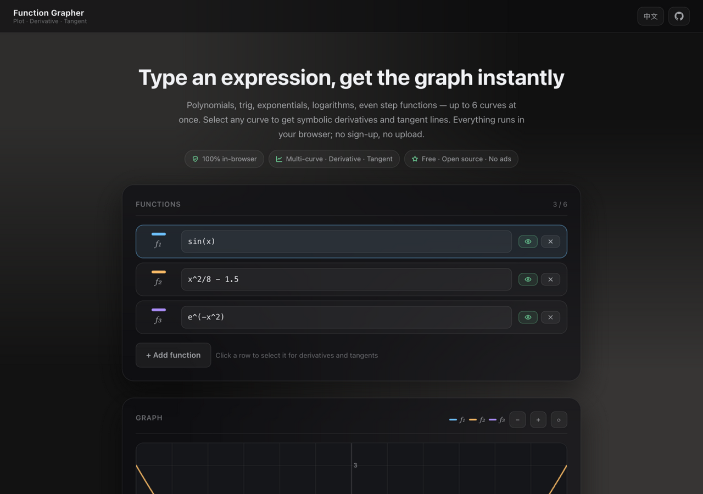
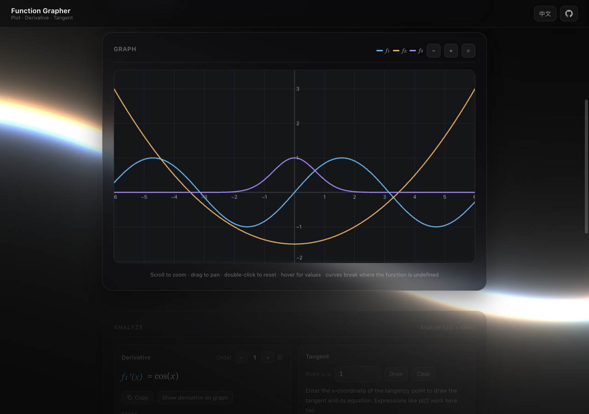

# 函数图像生成器 · Function Grapher

在线绘制任意函数图像的工具：多函数同图对比、符号求导、原函数与导数叠加、生成切线方程。**纯静态、零依赖、纯前端计算，输入不会上传到任何服务器。**

**在线使用：https://forjiang.github.io/function-grapher/**


## 功能

| | |
| --- | --- |
| **多函数同图** | 最多 6 条曲线，独立颜色、独立显隐、随时增删，输入即画 |
| **符号求导** | 1–8 阶任意切换，幂法则 / 乘积 / 商 / 链式法则逐层展开，带完整求导步骤 |
| **原函数叠加** | 一键把选中函数的原函数（半透明实线）与当前阶导数（虚线）叠到同一张图上对比 |
| **切线方程** | 切点支持表达式（如 `pi/2`），画出切线并给出解析方程 |
| **顺手的画布** | 滚轮缩放、拖拽平移、双击复位、悬停读出所有函数值；y 轴自适应，渐近线与跳变点自动断笔 |
| **函数库** | 20+ 常用函数一键添加：幂 / 三角 / 反三角 / 指数对数 / 双曲 / 阶梯（floor、sign、sinc） |
| **计算日志** | 终端风格实时记录每一步操作（解析、求导、切线、视图），像处理流水线一样透明 |
| **友好的输入** | 隐式乘法（`2x`、`xsin(x)`）、Unicode 写法（`π`、`√`、`x²`）自动识别，错误定位到第几个字符 |
| **中英双语** | 跟随系统语言，顶栏一键切换，选择记在 localStorage；连解析错误都分中英（引擎错误带 code，界面侧查译文） |

## 界面预览



首屏是 hero 与函数列表：三条示例曲线（sin(x)、x²/8 − 1.5、e^(−x²)）输入即画，每行可独立显隐、增删；
顶栏右侧是中英切换。下面的界面是画布与分析面板：多曲线同图、悬停读值，选中函数即可得到各阶导数、
求导步骤与切线方程；两个开关可以把选中函数的原函数（半透明实线）与当前阶导数（虚线）叠到图上对比。



## 设计语言

玻璃面板与控件语言对齐姊妹站 [image-metadata-cleaner](https://forjiang.github.io/image-metadata-cleaner/)：深色单一主题
（`#0a0a0c`）、`rgba(13,14,18,.62)` 半透明玻璃面板（白色 9% 描边、22px 圆角卡片）、近白主 CTA。背景是自研 WebGL
fragment shader 绘制的 RGB 正弦波场（`assets/js/wave-bg.js`，三条正弦波分别驱动 R/G/B 通道、按到屏幕中心的距离扭曲，
无第三方依赖），终端风格计算日志沿用 IMC 同款 `log.js`（环形缓冲 + 成功/失败分级配色），卡片入场是 `data-reveal`
淡入上移。移动端做了三处适配：画布高度用 CSS 固定值 + 阴影降级、窄屏面板模糊从 18px 降到 8px、
`prefers-reduced-motion` 下动画静止。站点图标由 `tools/make_icons.py` 纯标准库光栅化生成（圆角矩形 SDF +
贝塞尔曲线距离场，不依赖 PIL），主图标 base64 内联规避浏览器 favicon 缓存。

加载上做过一轮精简：WebGL 背景延后到页面 `load` 事件之后才创建上下文、编译 shader，不占首屏关键路径；
未使用的 CSS 规则、状态字段与模块导出均已清掉（全仓库语料比对确认，非动态拼接的类名才删）。

双语（中英）同样沿用 IMC 的模式：`assets/js/i18n.js` 词典 + `data-i18n` 静态标注 + `t(key, vars)` 动态文案，
顶栏一键切换、跟随系统语言、localStorage 记忆；连解析错误都分中英——引擎抛错时带 `code/vars`，
英文下由界面拼出 `Near character N: ...` 这样的完整译文。

## 它是怎么工作的

```
浏览器（纯静态站点，GitHub Pages）
 ├─ assets/js/engine.js   表达式 → AST → 求导规则 → 化简 → 数学排版渲染
 ├─ assets/js/plot.js     逐点采样求值，Canvas 绘制；箱线图胡须法自适应 y 范围
 ├─ assets/js/main.js     函数列表 / 分析面板 / 画布交互 / 日志与语言接线
 ├─ assets/js/log.js      终端计算日志（与 image-metadata-cleaner 同款）
 ├─ assets/js/i18n.js     中英双语文案（与 image-metadata-cleaner 同模式）
 ├─ assets/js/wave-bg.js  WebGL RGB 正弦波背景
 └─ assets/js/reveal.js   卡片入场动画（不依赖 IntersectionObserver）
```

## 测试

```bash
node tests/engine.test.cjs    # 285 项：符号导数 vs 中心差分、解析往返、错误码、中英 key 对齐
```

每个内置函数的导数都与数值差分交叉验证过，测试还覆盖了复合函数（专门抓链式因子遗漏）、
同底幂合并、分数约分等化简路径，以及中英词典的 key 对齐（防止漏翻）。

## License

MIT
